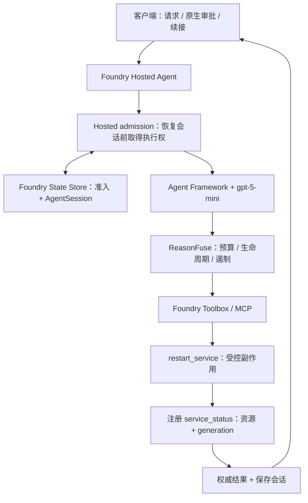

# ReasonFuse

ReasonFuse is a cloud-validated reliability runtime for side-effecting AI agents that separates planning, authorization, execution, verification, and success determination.

当前路径是 **一个 Agent + Microsoft Foundry Hosted Agent + Operations Toolbox + 一个受控重启场景**。核心已在 `reasonfuse` **v10** 上通过 CLOUD-1 至 CLOUD-12。它不是生产运维平台。

**当前云可用性：BLOCKED。** 2026-09-21 22:25 UTC（新西兰9月22日）的 [最终只读核查](docs/evidence/submission/cloud-readonly-final.json) 显示原 `rg-reason-fuse` 已不存在，原 Foundry 地址返回 ResourceNotFound，原订阅 Cognitive Services 账户列表为空。本轮没有删除云资源；历史 v10 PASS 仍保留。现阶段不能称为只差录像，见最终验收的具体阻塞。

先读本文，再看 [提交摘要](SUBMISSION-READY.md)、[录制脚本](docs/demo-script.md) 和 [最终验收](docs/submission-sprint.md)。[中文全景报告](docs/project-overview-zh.md) 保留提交冲刺开始前的工程快照。

## 问题

“模型说成功”“工具请求被接受”“副作用已执行”“目标状态已达到”是四件事。`accepted=true` 或 HTTP 202 不能证明服务恢复健康；Todo 变化也不等于客观进展。

模型提出动作，原生审批授权，ReasonFuse 在执行前确定权限和预算，在接受后登记验证义务，再用注册的外部观察决定是否成功。

## 架构



当前外部对象为测试夹具中的 `orders`。同一资源、同一 generation 的新鲜 HEALTHY 观察才得到 VERIFIED；匹配的不健康结果为 FAILED；陈旧、不匹配或缺失证据为 UNKNOWN。

## 实现的保证

- 重启必须原生审批；用户文本不等于审批。
- 派发前原子预留步骤、工具和副作用预算，取消后不假装没有尝试过。
- 接受动作产生验证义务；验证额度包含在总预算内。
- 模型跳过验证时，完成中间件执行注册验证器；陈旧观察不能 VERIFIED。
- FAILED / UNKNOWN 遏制后续操作，重新批准不能自动绕过。
- 操作类回答与结构化结果由运行时替换，再发布权威历史；流式输出先缓冲至完成验证。
- Hosted 准入先于会话恢复，延续至保存完成；ETag 条件写拒绝竞争，响应别名拒绝旧分支。
- 不确定执行权不自动过期或转交，见 [人工对账手册](docs/recovery-runbook.md)。

默认契约为 12 个核心步骤、10 次工具调用、最多 1 次副作用尝试。runtime 模式强制保护及后置条件；[配置](src/reasonfuse/config.py)、[契约](src/reasonfuse/core/contract.py)、[完成边界](src/reasonfuse/completion.py)、[准入](src/reasonfuse/host_admission.py) 可直接审查。

## 当前验证

| 验证层 | 结果与证据 |
| --- | --- |
| 本地完整回归 | **131/131 PASS**：原核心100项与新增辅助脚本31项；见 [最终验收](docs/submission-sprint.md) |
| 真实 Hosted | **v10 CLOUD-1 至 CLOUD-12 PASS**：[报告](docs/evidence/p0-hosted-concurrency-validation.md) / [逐项索引](docs/evidence/p0-foundry/hosted-concurrency/scenario-index.json) |
| 历史并发缺陷 | v7/v8 FAIL，v9 复现重复派发和状态覆盖；v10 持久化准入修复了被测两种续接路径，旧证据保留 |
| 15 场景 ON/OFF | [固定协议、JSON/CSV 与评测结果](docs/evaluation.md)；本地脚本化控制和真实模型结果分开，未执行项明确记录 |
| 身份与完整性 | v10 28 个源码文件与 70 个证据清单项；检查历史身份以及当前核心不变，不因更新 README 重写历史哈希 |
| Foundry Local | 当前冻结核心一次真实本地模型 smoke **PASS**：审批前零派发、重启后注册验证 VERIFIED；[原始结果及计量限制](docs/evidence/submission/local-model-smoke.json) |

云 PASS 使用真实模型、原生审批、MCP 和独立后端计数。本轮不会为了重现已有 PASS 再付费跑整套云验证。评测仅覆盖固定 15 场景，不声称统计显著性或普适收益。

## 本地检查与演示

已有 Python 3.13 虚拟环境时，下列检查不访问 Azure：

```powershell
$env:PYTHONPATH = 'src'
.venv/Scripts/python.exe -B -m unittest discover -s tests -p 'test*.py'
.venv/Scripts/python.exe scripts/check_hosted_concurrency_evidence.py
.venv/Scripts/python.exe scripts/check_submission.py
git diff --check
```

新环境执行 `uv sync --frozen --python 3.13` 可能下载依赖；`pwsh -File scripts/bootstrap.ps1` 会准备固定 azd/扩展，也可能下载，不能称为离线操作。

精确参数及前置资源见 [演示环境手册](docs/demo-environment.md)。这些脚本已准备并本地验证，尚未在本轮重新部署；它们要求已存在有效的 Foundry 项目、模型和 v10 基线，目前该前提不满足：

```text
demo-up.ps1    → 临时夹具、发布 Toolbox、检查 Agent
demo-smoke.ps1 → 端点、MCP 两工具、原生审批配置
demo-run.ps1   → A VERIFIED / B FAILED 后 BLOCKED / C 并发保护
demo-down.ps1  → 只清理本轮拥有资源与会话，并读回确认
```

先运行 DryRun，云执行需显式执行参数。脚本要求复用有效项目、模型与 v10，不创建基础平台。**原 Foundry 基础资源与临时后端当前均不可用。** 录制前须先恢复并验证基础资源，再启动夹具，结束后精确清理。

### 两层 store

| 所在层 | 当前值 |
| --- | --- |
| 外部客户端 → Hosted Responses，含首次请求和续接 | **`store=true`** |
| Agent 内部 → 模型 | **`default_options={"store": False}`** |
| Hosted 历史 | **`history_source="agent_server"`** |

不要沿用历史 v6 的外部 `store=false` 示例。v10 对该模式失败关闭，错误体验仍为 HTTP 500；竞争当前返回 failed Responses / `server_error`，不是统一 HTTP 409 契约。

## 三个演示故事

1. **A：接受仍需验证。** 批准 → accepted/g2 → 注册读取 HEALTHY/g2 → VERIFIED。
2. **B：失败后不能靠再批准绕过。** accepted → 匹配 UNHEALTHY → FAILED → 新批准 BLOCKED → 没有第二次派发。
3. **C：竞争续接。** 一方取得准入，另一方在工具前失败。在这个被测场景中只接受一次测试副作用；不是通用 exactly-once。

讲解词与录制清单见 [demo-script.md](docs/demo-script.md)。不生成假截图，不代替人工录制。

## 限制

- 只注册 `restart_service → service_status`，不保证任意工具正确性。
- 本地/云操作后端都是内存测试夹具，不重启生产基础设施；reset 为带外管理，不是 Agent 工具。
- 未验证云崩溃、驱逐、网络分区恢复、高负载或广泛多用户生产行为；无广义分布式 exactly-once。
- 无自动回滚/解锁；BUSY 可持续阻止执行，失败关闭不恢复业务可用性。
- 整回合缓冲增加首字等待和内存占用，未新增回合体积上限。
- 固定 SDK 包含预览版本和内部生命周期接口；[State Store 为预览能力](https://learn.microsoft.com/en-us/azure/foundry/agents/concepts/agent-state-store)，升级需复验。
- 未验证 Foundry IQ、App Insights 故障链路；不包含 Dashboard、APIM、Kubernetes 生产集成、多 Agent。
- 不宣称通用防幻觉、生产就绪或比赛获奖保证。

## 证据阅读顺序

[提交摘要](SUBMISSION-READY.md) → [验收](docs/submission-sprint.md) → [评测](docs/evaluation.md) → [v10 云证据](docs/evidence/p0-hosted-concurrency-validation.md)。

[历史索引](docs/evidence/README.md) 明确标识 v6、v7/v8 FAIL、v9 诊断、v10 PASS。历史命令不自动成为当前指南；历史结果、时间戳和哈希不为美化而改写。
