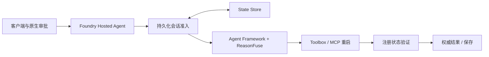

# ReasonFuse — 提交前阅读页

```text
SUBMISSION_READY = NO
```

工程与材料已推进到冻结验收；当前仍有**预算与云可用性阻塞**。原 Foundry 资源组已不存在，真实模型ON/OFF未运行；不能说现在只差录制。详细 [验收矩阵](docs/submission-sprint.md) 与 [最终资源读回](docs/evidence/submission/cloud-readonly-final.json) 明确区分历史证明和当前状态。

## 项目与架构

ReasonFuse 给有副作用的 AI Agent 增加确定性运行约束，把计划、授权、执行、验证和成功判断分开。HTTP 202 / accepted 不等于结果成功。



核心贡献是：操作接受后形成验证义务；只有匹配的新鲜外部后置条件支持成功。FAILED/UNKNOWN 遏制后续派发，重新审批不绕过它；Hosted 通过条件写在恢复会话前取得执行权，防止竞争请求各自恢复旧预算。

## 证据

- 完整本地回归 **131/131 PASS**：冻结核心100项、评测与演示辅助工具31项。
- **真实 Foundry v10 CLOUD-1..12 PASS**；涵盖审批、结果验证、输出与历史、流式边界、遏制、续接、并发。
- **本地15场景×ON/OFF**：0对5次无依据成功，0对2次重复派发尝试；这是脚本化模型控制证据。真实云对照30项为 NOT RUN—BUDGET CONSTRAINT。
- 当前源码另有一次已加载真实 Foundry Local 模型 smoke：原生审批→一次重启→注册验证→VERIFIED。它不是 Hosted 证明；实际本地模型调用次数未完整计量。
- v7/v8 FAIL、v9诊断、v10 PASS、原始时间戳和哈希保留；没有把旧失败改成成功。

## 三段演示与复现

基础云资源恢复并完成必要确认后，按 [环境手册](docs/demo-environment.md) 运行：

```powershell
pwsh -File scripts/demo-up.ps1 -RunId final-demo -DryRun
# 确定环境与预算后，Execute 会创建有归属的临时夹具。
pwsh -File scripts/demo-up.ps1 -RunId final-demo -Execute
pwsh -File scripts/demo-smoke.ps1 -RunId final-demo -Execute
pwsh -File scripts/demo-run.ps1 -RunId final-demo -Story A -Execute
pwsh -File scripts/demo-run.ps1 -RunId final-demo -Story B -Execute
pwsh -File scripts/demo-run.ps1 -RunId final-demo -Story C -Execute
pwsh -File scripts/demo-down.ps1 -RunId final-demo -Execute
```

A展示 accepted 之后还需 HEALTHY/generation 验证；B展示 FAILED 后再批准仍 BLOCKED；C展示被测竞争续接只接受一次测试副作用。新脚本本轮只完成本地验证，标为 PREPARED-NOT-DEPLOYED。

## 限制与关键材料

只覆盖注册的重启/状态域；后端为测试夹具。无通用防幻觉、生产就绪、任意工具正确性、广义 exactly-once、高负载或网络分区恢复保证；SDK/State Store 有预览依赖，BUSY没有自动恢复。

[当前 README](README.md) · [最终验收](docs/submission-sprint.md) · [v10真实云证据](docs/evidence/p0-hosted-concurrency-validation.md) · [15场景结果](docs/evaluation.md) · [录制稿](docs/demo-script.md) · [人工恢复手册](docs/recovery-runbook.md) · [历史索引](docs/evidence/README.md)
