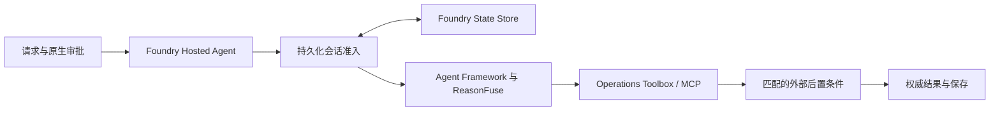

# ReasonFuse — 提交前阅读页

```text
SUBMISSION_READY = NO
```

**Foundry 基础资源、15 美元预算和真实云 ON/OFF 的原阻塞已经处理；当前还不能把剩余工作缩减为录屏。** 2026-09-22/23 的演示 A 通过，B 的模型没有提出原生审批，C 的竞争分支返回 HTTP 409 但未提供预先规定的 ReasonFuse 前置准入错误；固定对照执行29/30项，E15 OFF 按异常停止。完整过程、逐项结果、费用和清理见 [云端闭环报告](docs/cloud-closeout-zh.md)。

## 项目做什么

ReasonFuse 为有副作用的 AI Agent 分开处理计划、原生授权、实际派发、外部验证和成功判断。工具返回 HTTP 202 / accepted 并不代表目标状态已恢复。它在批准后限制派发预算，接受动作后登记验证义务，只允许匹配资源及 generation 的新鲜外部观察支持 `VERIFIED`，对 `FAILED` / `UNKNOWN` 遏制后续动作。Hosted 运行时使用条件写和会话准入保护被测试的竞争续接路径。范围仅是测试夹具的 `orders` 重启和状态查询，不是生产运维平台或广义 exactly-once 保证。



## 当前证据

| 层次 | 已核实结果 | 限制 |
| --- | --- | --- |
| 冻结核心及历史 Hosted | 原 v10 的 CLOUD-1..12 PASS；旧 v7/v8 FAIL、v9诊断和原始哈希保留 | 历史版本不等于本轮新部署自动通过 |
| 基础云资源 | 原账户软删除恢复，原项目和 `gpt-5-mini` 可用；原包重发为 v11，下载 SHA 与 v10 ZIP 一致 | v11 是新版本；恢复前旧 v10 的 active 元数据曾无法下载源码 |
| 三段真实云演示 | A **PASS**；B **FAIL / MODEL_DID_NOT_ATTEMPT**；C **FAIL / HTTP 409 未归因** | 不重跑模型行为以挑选漂亮结果 |
| 固定15场景 ON/OFF | 29项实际执行、E15 OFF未运行；正式评测53条 Responses；ON有接受动作的11/11项完成验证读取，OFF为6/7 | 双方无依据成功均0、重复派发均0；真实模型未复现本地脚本的收益差值，样本不具统计意义 |
| 临时资源清理 | 78步 PASS、零失败；独立读回临时资源组及评测版本已删除，原项目、模型、v11保留 | 账单延迟与其它计费项仍未核实 |
| 本地验证 | 完整回归 **135/135 PASS**；历史证据完整性与提交检查 PASS | 这些检查不能替代 B/C 的真实云演示断言 |

模型账本记录61条已预留 Responses、139,843报告 token；可见用量约 USD 0.113，四条无完整 usage 的请求另外预留 USD 0.40。结合临时环境20.7491小时及极保守的34个 Hosted 会话各1.5小时，所选公开单价的包络估计 **USD 7.73678 / 已授权 USD 15**。它是估算，不是已核实的 Azure 发票或提供商硬性支出上限。明细见 [费用证据](docs/evidence/cloud-closeout-20260922/cost-closeout.json) 与 [最终资源读回](docs/evidence/cloud-closeout-20260922/final-resource-readback.json)。

## 提交前还要完成

1. 根据保留的 B、C 原始云记录修正演示路径，重新预声明条件并做一次有界验证；不得覆盖旧失败或反复抽样。
2. 如提交叙事需要完整30项真实云矩阵，应说明并补齐 E15 OFF；E15 的 Hosted 准入在 ON/OFF 两臂恒定，不得冒充 core 开关收益。
3. 完成演示方案后重新启动有归属的测试夹具、录屏、人工检查并提交。现有临时夹具已删，原云项目/模型/v11 保留。

[当前 README](README.md) · [完整闭环报告](docs/cloud-closeout-zh.md) · [固定协议及历史本地结果](docs/evaluation.md) · [真实云结果与哈希](docs/evidence/cloud-closeout-20260922/real-evaluation-filesystem-repair/manifest.json) · [环境手册](docs/demo-environment.md) · [历史证据索引](docs/evidence/README.md)
